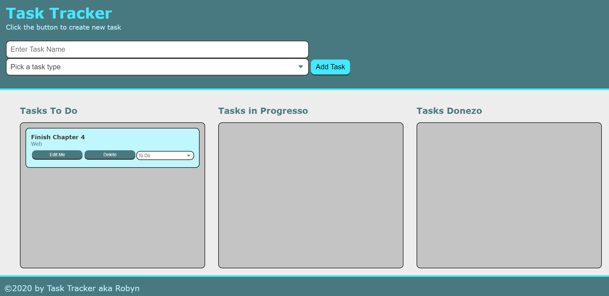

# task-tracker

## Description
A Kanban-style task tracker.  Enter your task and have it stored in the To-Do section. Update your task to In-Progress section or Completed section. Delete or edit your tasks as needed.

## Links
deployed at 
https://robyng.github.io/task-tracker/

code source at
https://github.com/robyng/task-tracker

## Screenshot

